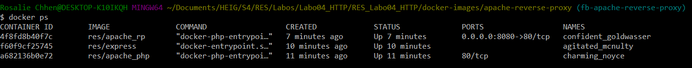
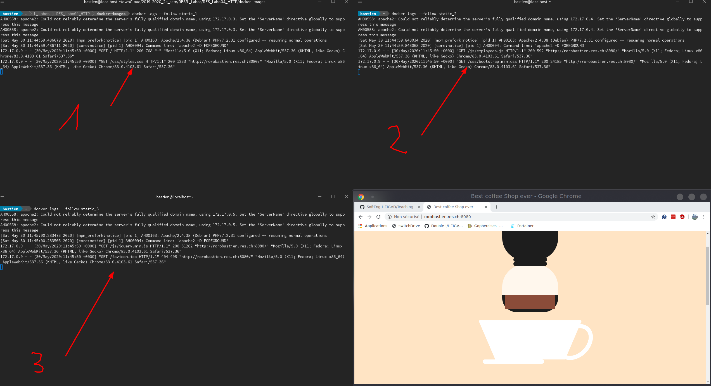

# RES - Labo 04 - HTTP

## Step 1

1. Create a repo 

Création du répertoire docker-images/apache-php-image/

Dans ce dossier, on créé un dossier public-html et un Dockerfile.

2. Create a Docker image from a base Docker image

Sur _Docker hub_, recherche d'image **hhtpd**, dont la documentation nous mène à un lien sur une image docker Apache avec php officielle. La version que nous avons utilisé est la version 7.2, beaucoup plus récente que celle utilisée dans la vidéo. Cette image documente la manière dont il faut utiliser l'image avec un Dockerfile, nous avons ajouté ces lignes au Dockerfile : 

```
FROM php:7.2-apache
COPY ./public-html /var/www/html/
```

4. Explore the structure of the image

Tentative de connexion avec le serveur établi avec netcat : le serveur tourne et répond avec le code status _400 Bad Request_.


5. Add the conf/content

On ajoute dans **public-html** : index.html file et une styles.css pour afficher une animation de café 

```
docker build -t res/apache_php .
docker run -d -p 9090:80 res/apache_php
```


## Step 2a

1. Création du répertoire express-image dans docker-images, et ajout d'un Dockerfile.

2. Create a Docker image from a base Docker image

La version utilisé pour Node JS est la version 12.16.3, qui est donc plus récent que celle utilisée dans la vidéo. Nous avons ajouté ces lignes au Dockerfile :

```
FROM node:12.16.3

COPY src /opt/app

CMD ["node", "/opt/app/index.js"]
```

3. Add the content

Créer un répertoire src où on y ajoute un fichier index.js avec les lignes suivantes :

```
var Chance = require('chance');
var chance = new Chance();

console.log("Bonjour " + chance.name());
```

4. Explore the structure

On peut constater en démarrant le container que la version est la bonne


## Step 2b

1. Use the Express.js framework

Installer le framework js dans notre dossier "src" pour cela, nous avons utilisé les commandes suivantes :

```
npm install --save express
```

2. Return json payload on GET requests

Pour pouvoir retourner un payload json lorsqu'on accède à l'URL, nous avons modifié notre précédent index.js avec les lignes suivantes :

```javascript
var Chance = require('chance');
var chance = new Chance();

var express = require('express');
var app = express();

app.get('/', function(req, res){
    res.send(generateEmployees(req.query.maxNb))
});

app.listen(3000, function(){
    console.log('Accepting HTTP requests on port 3000.')
});

function generateEmployees(maxNb){
    var numberOfEmployees = chance.integer({
        min: 0,
        max: maxNb
    });

    var employees = [];

    for(var i = 0; i < numberOfEmployees; ++i){
        var gender = chance.gender()
        employees.push({
            firstName: chance.first({
                gender: gender
            }),
            lastName: chance.last(),
            gender: gender,
            email: chance.email(),
            salary: chance.euro()
        });
    }

    return employees;
}
```

Pour que l'on puisse également voir si il était possible que le client puisse agir sur notre génération des employés, nous avons ajouté un paramètre à la requête '/' pour que l'on puisse dans notre navigateur avec une url de ce style : 

```
http://localhost:3000/?maxNb=12
```


3. Run and test the containers


## Step 3b

Configuration d'un reverse proxy dont on hardcode les adresses ip des containers qui font tourner le serveur web et teste du reverse proxy en interactif dans un container.

1. Configuration du reverse proxy

On lance un container avec l'image apache-php statique et un autre avec l'image express dynamique et on regarde leur adresse ip :

```
apache_static : 172.17.0.2
express_dynamic : 172.17.0.3
```


On contrôle en se plaçant dans la vm de docker (avec docker-machine sur windows) qu'on peut envoyer une requête GET / HTTP/1.0 au serveur, avec telnet aux 2 adresses ip.

 

On lance un container avec l'image php:7.2-apache en interactif et port-mappé sur le port 8080.
```
docker run -it -p 8080:80 php:7.2-apache /bin/bash
```

 On créé une configruation dans le dossier etc/apache2/sites-available dans un fichier nommé 001-reverse-proxy.conf.

(Et installation de vim dans ce container).

Contenu du fichier de configuration (la première règle renvoie à la page dynamique et la règle générale à la page statique) : 


2. Tester le reverse proxy

Toujours dans le container, on active les modules nécessaire à la configuration (précisé dans la documentation), avec les commandes suivantes :

```
a2enmod proxy
a2enmod proxy_http

service apache2 restart
```

On établit la connexion à travers le reverse proxy, depuis l'extérieur (on utilise donc l'adresse ip utilisée par docker et le port 8080 auquel on a mappé le container du reverse-proxy).

Avec une requête qui doit suivre la première règle de la configuration (retourne page dynamique).


Avec une requête qui doit suivre la règle générale de la configuration (retourne page statique).


## Step 3c

Configuration d'un reverse proxy dont on hardcode les adresses ip des containers qui font tourner le serveur web et teste du reverse proxy avec une image pour le reverse-proxy.

1. On créé un dossier dans docker-images, pour le reverse-proxy avec un Dockerfile.

Contenu du Dockerfile : 

```
FROM php:7.2-apache

COPY conf/ /etc/apache2

RUN a2enmod proxy proxy_http
RUN a2ensite 000-* 001-*
```

2. Configuration du reverse proxy

Dans le dossier docker-images/apache-reverse-proxy/conf/sites-available, on créé les fichiers 000-default.conf et 001-reverse-proxy.conf. 

On lance un container avec l'image apache-php statique et un autre avec l'image express dynamique et on regarde leur adresse ip :

```
apache_php : 172.17.0.3
express : 172.17.0.2
```

Contenu du fichier de configuration (la première règle renvoie à la page dynamique et la règle générale à la page statique) : 

```
<VirtualHost *:80>
    ServerName rorobastien.res.ch

    #ErrorLog ${APACHE_LOG_DIR}/error.log
    #CustomLog ${APACHE_LOG_DIR}/access.log combined

    ProxyPass "/api/employees/" "http://172.17.0.2:3000/"
    ProxyPassReverse "/api/employees/" "http://172.17.0.2:3000/"
    
    ProxyPass "/" "http://172.17.0.3:80/"
    ProxyPassReverse "/" "http://172.17.0.3:80/"

</VirtualHost>
```

3. Test du reverse-proxy

On lance un container avec l'image apache-reverse-proxy.



On établit la connexion à travers le reverse proxy.

Avec une requête qui doit suivre la première règle de la configuration (retourne page dynamique).


Avec une requête qui doit suivre la règle générale de la configuration (retourne page statique).


4. Configurations DNS

On modifier le fichier hosts (sous windows) qui se trouve dans etc pour faire correspondre l'addresse ip utilisée par le reverse-proxy avec le nom du serveur :
```
192.168.99.100 	rorobastien.res.ch
```

Sur un browser, on voit que la configuration a fonctionné :


## Step 4

1. Update the images to install vim

Préférant utilisant nano, nous avons donc installer nano à la place de vim et avons donc modifié l'étape proposé de la manière suivante :

```docker
RUN apt-get update && \
    apt-get install -y nano
```

2. Log into the static http container

Pour cette partie, nous avons préféré directement modifier et rebuild à chaque fois qu'on réalisait des changements dans notre éditeur de texte (dans notre cas cela était Visual Studio Code et Atom) et n'avons donc pas réalisé les modifications en mode interactive de notre container.

3. Create our own Javascript script

La vidéo nous propose d'utiliser un modèle de site Web qui possède déjà Jquery. Notre modèle apache statique que nous avons décidé d'utiliser n'utilise pas Jquery. Par conséquent, il nous a donc fallu le télécharger et l'ajouter avec également la partie bootstrap car notre animation de café ne l'utilisait pas.

On peut retrouver ici le lien pour télécharger bootstrap

https://getbootstrap.com/

Et le lien ici pour télécharger Jquery

https://jquery.com/download/

4. Use JQuery to do an AJAX request + to update a DOM element

Le code Javascript que nous avons réalisé pour cette partie est le suivant. Nous avons rajouté une "table" qui contiendra la liste des employés proposés par notre entreprise rorobastien.  :

```javascript
$(function(){

    function loadEmployees(){
        $.getJSON( "/api/employees/", function( employees ) {
            $('#employees tbody').empty();
            $.each( employees, function( id, employee ) {
                $("#employees tbody").append('<tr><td>' + employee.firstName + '</td><td>' + employee.lastName + 
                '</td><td>' + employee.gender + '</td><td>' + employee.email + '</td><td>' + employee.salary + '</td></tr>')
            });
        });
    }

    loadEmployees();
    setInterval(loadEmployees, 5000);

});
```

5. Rendu final de notre application


## Step 5

1. Add a setup phase in the RP Dockerfile (change CMD and invoke a script)

Dans la vidéo, on peut constater que la version de php utilisée est la 5.6, par conséquent, il nous a fallu trouver le git où la version de php correspond à la notre (qui est la version 7.2)

Nous l'avons trouvé au lien ci-dessous :
https://github.com/docker-library/php/tree/master/7.2/buster/apache

On peut constater que quelques changements se sont fait notamment apache-foreground qui est différent de celui présenté dans la vidéo (où seuls 3 lignes y sont présentes)

Par contre, nous avons constaté qu'il n'y a pas de changement concernant la commande utilisée à la fin qui est "apache-foreground".

De même il n'y a pas de modification concernant le dossier /usr/local/bin qui est le même utilisé que dans la version 5.6

2. Use PHP to create a template for the RP configuration file

Pour cette partie, nous avons préféré ne pas modifier notre variable d'environnement ou d'installer php sur notre machine et par conséquent, nous n'avons pas testé le fonctionnement de notre script PHP. Le code est le suivant :

```php
<?php
    $ip_static = getenv('STATIC_IP');
    $ip_dynamic = getenv('DYNAMIC_IP');
?>

<VirtualHost *:80>
    ServerName rorobastien.res.ch

    #ErrorLog ${APACHE_LOG_DIR}/error.log
    #CustomLog ${APACHE_LOG_DIR}/access.log combined

    ProxyPass '/api/employees/' 'http://<?php echo "$ip_dynamic" ?>/'
    ProxyPassReverse '/api/employees/' 'http://<?php echo "$ip_dynamic" ?>/'
    
    ProxyPass '/' 'http://<?php echo "$ip_static" ?>/'
    ProxyPassReverse '/' 'http://<?php echo "$ip_static" ?>/'

</VirtualHost>
```

Puis nous allons modifier notre Dockerfile de manière à copier ce fichier PHP dans notre image docker.

```docker
COPY apache2-foreground /usr/local/bin/
```

Nous allons également ajouté le script suivant à apache2-foreground pour pouvoir se baser non-pas sur des IP statiques mais sur des IP dynamiques

```bash
# Setup for RES lab
echo "Setup for RES lab..."
echo "Static app URL : $STATIC_IP"
echo "Dynamic app URL : $DYNAMIC_IP"
php /var/apache2/templates/config-template.php > /etc/apache2/sites-available/001-reverse-proxy.conf
```

3. Testing our container

On peut constater en lançant une multitude de container puis en utilisant nos variables d'environnement que notre setup fonctionne.


## Step 6

1. Dans cette étape, nous n'aurons plus besoin de gérer nos Docker via le terminal, mais nous pouvons utiliser une interface graphique. Pour cela, nous avons décidé d'utiliser https://www.portainer.io/. 

2. La procédure d'installation est la suivante :

```bash
docker volume create portainer_data
docker run -d -p 8000:8000 -p 9000:9000 --name=portainer --restart=always -v /var/run/docker.sock:/var/run/docker.sock -v portainer_data:/data portainer/portainer
```

Il suffit après d'aller à l'adresse http://localhost:9000


Où vous pourrez créer votre utilisateur administrateur


Après avoir enregistré utilisateur, choisissez que vous allez gérer votre environnement local Docker puis cliquez sur le bouton "Connect".


Vous arrivez sur cette page. Cliquez sur le Endpoitn "local" pour accéder à vos images "local" et à vos containers.

3. Démarrer notre application rorobastien.res.ch

Pour démarrer nos différents containers qui sont formés des images :

- apache_static
- express_rorobastien
- apache_rp

Nous devons démarrer un container pour cela, aller dans l'onglet "Containers" puis cliquer sur "Add container"


Puis, nous allons démarrer notre container "apache_static" en premier (il n'y a pas d'importance hormis pour le dernier container qui est apache_rp), pour cela, il suffit de remplir le formulaire de la même manière que la capture d'écran ci-dessous :


De même, il suffit de démarrer le container "express_rorobastien" également de la même manière que dans l'image précédente.

Finalement, nous allons démarrer notre container "apache_rp", pour cela la configuration du démarrage de notre container va légèrement différer.

Nous allons tout d'abord devoir inspecter les adresse IP de nos containers. Nous pouvons les observer dans la liste des "container" dans l'onglet "Containers"


Nous noterons alors pour les variables d'environnements les valeurs suivantes :

```bash
STATIC_IP=172.17.0.3:80
DYNAMIC_IP=172.17.0.4:3000
```

Nous allons donc démarrer notre container apache reverse proxy avec la configuration suivante :


4. Rendu et vérification

On peut constater que notre environemment d'application travaille correctement. Puisque notre container reverse proxy redirige correctement vers notre page pour les cafés.


## Step 7

Pour cette partie, nous allons étendre notre configuration de ReverseProxy pour pouvoir supporter la Répartition de charge (Load balancing en anglais).

Pour cela, nous allons devoir activer la répartition de charge sur notre container Apache Reverse Proxy.

1. La première étape est d'activer les modules nécessaires au fonctionnement du Load balancing. Pour cela, nous allons modifier la ligne suivante dans notre Dockerfile en y ajoutant différents modules.

```
RUN a2enmod proxy proxy_http proxy_balancer proxy_hcheck lbmethod_byrequests
```

2. Nous allons devoir également modifier notre template de configuration pour pouvoir gérer une liste de Containers qui feront office de "server node".

```php
<?php
    $ip_dynamic = explode(";",getenv('DYNAMIC_IP'));
    $ip_static = explode(";", getenv('STATIC_IP'));
?>

<VirtualHost *:80>
    ServerName rorobastien.res.ch

    # ErrorLog ${APACHE_LOG_DIR}/error.log
    # CustomLog ${APACHE_LOG_DIR}/access.log combined

    <Proxy balancer://dynamicCluster>
<?php for ($i = 0; $i < count($ip_dynamic); $i++)
    echo "      BalancerMember ". $ip_dynamic[$i] . "\n";
?>
    </Proxy>

    <Proxy balancer://staticCluster>
<?php for ($i = 0; $i < count($ip_static); $i++)
    echo "      BalancerMember ". $ip_static[$i] . "\n";
?>
    </Proxy>

    ProxyPreserveHost On

    ProxyPass "/api/employees/" "balancer://dynamicCluster/"
    ProxyPassReverse "/api/employees/" "balancer://dynamicCluster/"
    
    ProxyPass "/" "balancer://staticCluster/"
    ProxyPassReverse "/" "balancer://staticCluster/"

</VirtualHost>

```

3. Pour prouver le bon fonctionnement de notre LoadBalancing, nous allons effectuer deux tests. Le premier test considère qu'il y a une défaillance sur l'ensemble des serveurs. Il n'y donc plus aucun serveur express qui fonctionne.


On peut constater qu'à un certain moment notre application réalise des connections vers 172.17.0.6 puis vers le deuxième serveur qui est 172.17.0.7. Finalement on s'aperçoit qu'il peut accéder à aucun des 2 serveurs et annonce qu'il n'y a aucune roûte vers l'hôte. On valide ainsi que notre Load balancing répartit les tâches entres 3, puis 2 et finalement 1 container. Puis lorsqu'il n'y a plus de container capable de gérer notre requête, notre application ne fonctionne plus.



Dans cette image ci-dessus, on voit qu'à la flèche 1, notre premier container va récupérer le styles.css, à la flèche 2, le second container va récupérer le bootstrap.min.css et le fichier javascript employees.js, puis finalement à la flèche 3, le fichier javascript jquery.min.js. Tout cela est réassemblé pour que notre requête vers la page d'accueil de rorobastien.res.ch est traitée.

## Step 8

1. ???


2. 